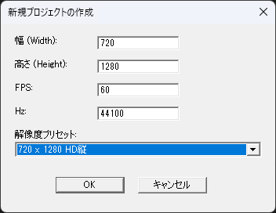

## 注意
# バグるかもなのでつかわないで

## プラグイン概要

本プラグインを導入後、拡張編集で新規プロジェクトを作成しようとすると、 **AviUtl.exe** と同じ階層に **resolutions.ini** が自動生成されます
このファイルの設定に基づいて、プロジェクト作成時の "解像度プリセット:" に選択肢が表示されるようになります
ファイルの記述形式に従って追記することで、独自の解像度プリセットを自由に追加することも可能です

- 動作確認は AviUtl version 1.10 / 拡張編集 version 0.92 で行っています。